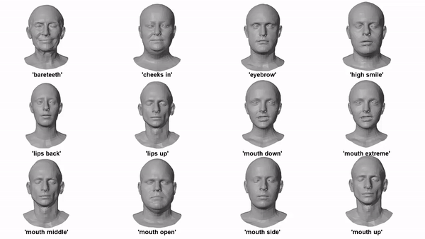
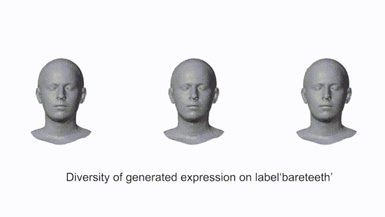
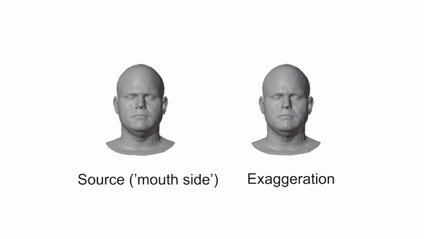
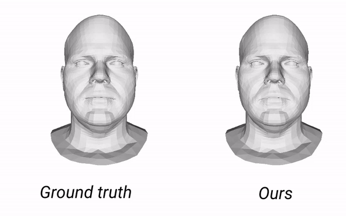
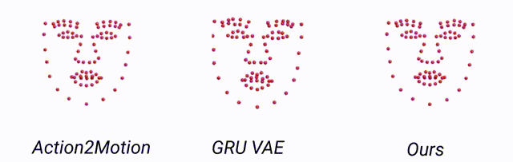

# 3D Facial Expression Generator Based on Transformer VAE.

## 1. Dataset

We test our method on [**CoMA dataset**](https://coma.is.tue.mpg.de/) and [**BU-4DFE data**](http://www.cs.binghamton.edu/~lijun/Research/3DFE/3DFE_Analysis.html).

### Data preparation
We extract landmarks from meshes in the CoMA dataset.

## 2. Model
Our approach is divided into two steps. Firstly, a Transformer VAE is trained to perform the conditional generation of landmarks sequences. Then a landmark-guided mesh deformation (LGMD) model estimates vertex-wise displacements in a frame-by-frame manner, given the desired expression represented by the landmark set and a neutral face to apply the deformation. The overview of our method is shown in the figure below.

                                       

## 3. Results

### 3.1 Mesh results
The full mesh animation can be obtained by our landmark-driven 3D mesh deformation, based on a Radial Basis Function. Some of the results thus obtained are shown below:  
  
#### 3.1.1 Random sampling from Gaussian distribution

  
 
#### 3.1.2 Diversity generated expressions

##### Diversity of "mouth open" expression
   
 
##### Diversity of "baretheeth" expression
   

##### Diversity 
  
 

 
#### 3.1.3 Exaggeration
 Since we add the displacements to the neutral face to deform it, an exaggerated expression can easily be obtained by multiplying the displacement with a constant value.
 
   
  
  
    
#### 3.1.4 Noise removal
  
    
   

### 3.2 Landmark videos for the visual comparison
The outputs of transformer VAE, a set of landmark sequences conditioned by the expression label, have been compared to those from other models for the qualitative jugements.   

#### "Happy" expression

   
 
 
 #### "Surprise" expression

   
 
    

## 4. Code
The code will be made available very soon!
