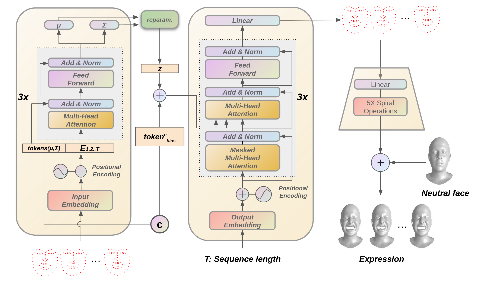
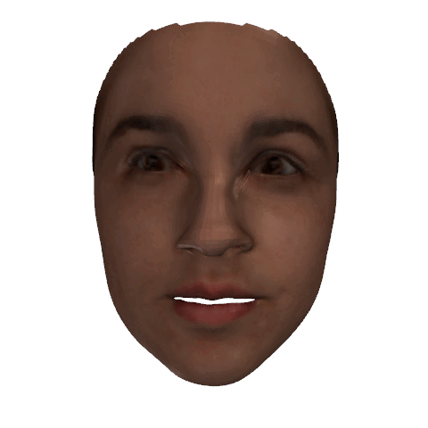
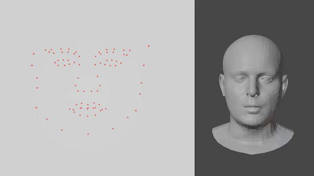
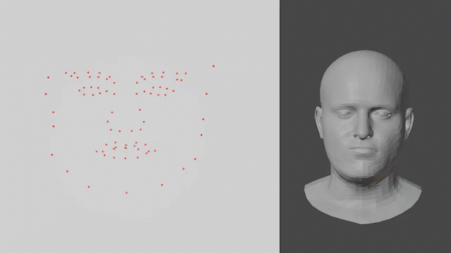
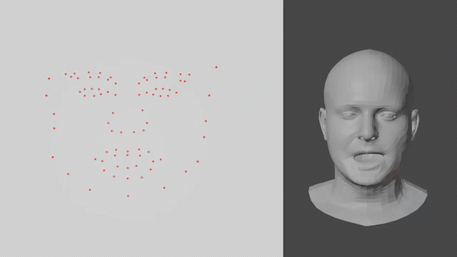
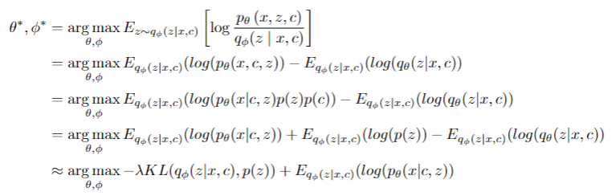

# 3D Facial Expression Generator Based on Transformer VAE.

## 1. Dataset

We test our method on [**CoMA dataset**](https://coma.is.tue.mpg.de/) and [**BU-4DFE data**](http://www.cs.binghamton.edu/~lijun/Research/3DFE/3DFE_Analysis.html).
## 2. Model
Our approach is divided into two steps. Firstly, a Transformer VAE is trained to perform the conditional generation of landmarks sequences. Then a landmark-guided mesh deformation (LGMD) model estimates vertex-wise displacements, which is used to deform a neutral face to the expected expression frame by frame.

                                       

### 3. Results

#### Diversity of mouth open
   
 
#### Diversity of baretheeth
   

#### Exaggeration
Since we add the displacements to the neutral face to deform it, an exaggerated expression can easily be obtained by multiplying the displacement with a constant value.
 

### Landmark videos for the visual comparison
The outputs of transformer VAE, a set of landmark sequences conditioned by the expression label, have been compared to those from other models for the qualitative jugements.   
   
 
 
### Videos of rendered meshes 
The full mesh animation can be obtained by our landmark-driven 3D mesh deformation, based on a Radial Basis Function. Some of the results thus obtained are shown below:  
| Model|Happy  | Surprise |  Angry | 
| ------------- | ------------- | ------------- | -------------------|
| Ours | |  |   | 
| | | | |     
| Action2Motion | |  |   | 
| | | | |  
|GRU-VAE| |  |   | 

<!--
### Rendered mesh results on <a href=https://coma.is.tue.mpg.de> COMA</a> dataset
Also has been developed is an autoencoder that can translate a landmark set to a full facial mesh.

        
  
     
-->
## 4. Supplementary material
Derivation of equation (3) from equation (2) in the paper is provided as below:

Note: The expectation is about variable z, so a term containing p(c) can be unhinged as a constant which has no impact on the maxmization. 
