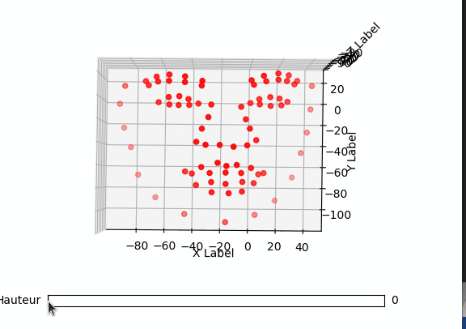
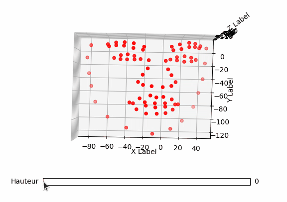

# DisenFace
Conditioned 3D face sequences generator

## 1. Dataset
Our dataset consist of [**BU face data**](http://www.cs.binghamton.edu/~lijun/Research/3DFE/3DFE_Analysis.html) and [**MUG face data**](https://mug.ee.auth.gr/fed/)  (To be introduced in the near future). 
  The dataset can be downloaded from [google drive](https://drive.google.com/drive/folders/1d8rlqXgbfDQxcOKvSIssm56jWUVz6oIe?usp=sharing)

## 2. Model
## 3. Results
Our results are based on 83 landmarks which will be reconstructed to 3D mesh
### Example           
| Happy  | Surprise |  Angry | 
| ------------- | ------------- | ------------- | 
|  |  |   |            
                                              
## 4. Future work
1. CVAE
2. GAN
3. Mesh (GCN)
